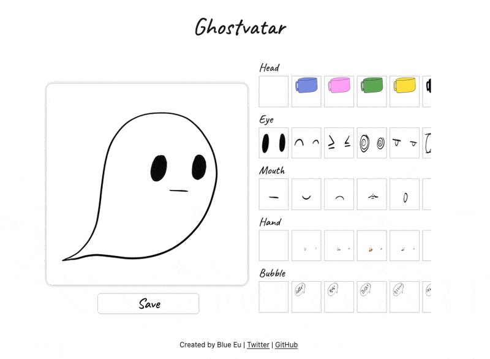

# Ghostvatar

Create your not-so-scary ghost profile picture.

## Demo
[ghostvatar.netlify.app/](https://ghostvatar.netlify.app/)

## Stack
- HTML5/CSS (SASS)
- JavaScript
- pnpm

---
Progress

2022-07-17
- heads, eyes, mouths, and hands are changeable
- image loading is an issue
- 

2022-07-17 (afternoon)
- html2canvas added to save an image
- saved image is too blurry
    -  `scale` attribute added in `html2canvas`
- 

2022-07-18
- UI improved
- 

2022-07-23
- Assets optimized
- 